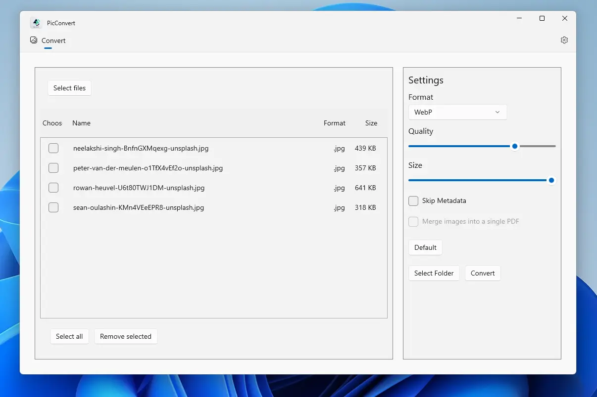

# PicConvert

PicConvert är en avancerad och användarvänlig bildkonverteringsapplikation som låter dig hantera och konvertera dina bildfiler snabbt och effektivt. Applikationen utnyttjar ImageMagick, ett kraftfullt bildbehandlingsbibliotek, för att säkerställa högkvalitativa konverteringar.

## Funktioner

- **Konvertering av flera bildfiler:** Välj flera bilder samtidigt och konvertera dem till olika format, inklusive PNG, JPEG, och WebP.
- **Justering av bildinställningar:** Anpassa format, kvalitet och storlek på dina bilder för att passa dina specifika behov.
- **Storleksändring och metadatahantering:** Ändra storlek på bilder och ta bort metadata för att skydda din integritet.
- **Sammanfoga bilder till PDF:** Smidigt sammanfoga flera bilder till en enda PDF-fil.
- **Öppen källkod och gratis:** PicConvert är ett hobbyprojekt, helt gratis att använda, utan reklam och ingen datainsamling.

## Installation

För att använda PicConvert på din Windows 10 eller högre:

1. [Ladda ner den senaste versionen](https://apps.microsoft.com/detail/9N65RVQB74MP?mode=direct) från Microsoft Store.

**OBS:** Appen är för närvarande inte tillgänglig på Microsoft Store då jag väntar på certifiering. Håll utkik efter uppdateringar!

## Användning

Efter installationen kan du öppna PicConvert och:

1. Välja de bilder du vill konvertera.
2. Justera inställningarna för format, kvalitet och storlek.
3. Klicka på "Konvertera" för att starta konverteringsprocessen.

## Licens
PicConvert är licensierat under MIT-licensen. Se filen `LICENSE` för mer information.

## Teknologi och Verktyg
PicConvert är byggt med hjälp av följande teknologier och verktyg:

- **C# och WinUI 3**: Applikationen är utvecklad i C# och använder WinUI 3 för att bygga moderna Windows-appar.
- **Template Studio for WinUI (C#)**: Projektet skapades med hjälp av Template Studio for WinUI, vilket ger en snabbstartsmall och olika kodgenereringar för att snabba upp utvecklingsprocessen.
- **Magick.NET (Magick.NET-Q16-AnyCPU)**: Ett .NET-bindning för ImageMagick, som används för bildkonvertering och hantering.
- **CommunityToolkit.Mvvm**, **WinUIEx**: Används för att förbättra funktionaliteten och användarupplevelsen.

